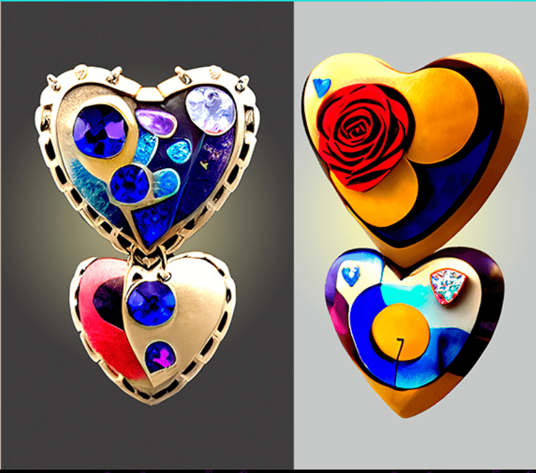

# Hearts Doesnt Beat Alone

人工智能可以创造艺术吗？是的。我们做得更好。\#ai #art #fashion #sciencefiction #NFT 合而为一

艺术界非凡的名字萨尔瓦多·达利（Salvador Dali）超越了现实，画了超现实主义的作品。大理也热衷于科技发展。甚至可以说，《记忆的永恒》（1931）这幅画中时间融化的形象受到了爱因斯坦相对论的影响。沃森和克里克对 DNA 螺旋结构的发现直接出现在“蝴蝶景观”（1957 年）中。

多年来一直有人说“好吧，比人类快得多，但计算机不能创造艺术”。但如今，人工智能可以制作出看起来像是出自伦勃朗笔下的作品。它甚至使用 GAN 和衍生算法生成超逼真的照片，人们无法区分它们是否真实。
另一方面，比特币和区块链技术正在迅速发展，具有改变人类经济历史的潜力。使用区块链上注册的具有所有者唯一签名的智能合约创建的 NFT 已经开始改变艺术史。我们热情地致力于当今的革命性发展，例如区块链、人工智能、NFT。凭借从萨尔瓦多·达利（Salvador Dali）获得的灵感，我们使用专注于超现实主义艺术的人工智能制作 NFT 作品。

