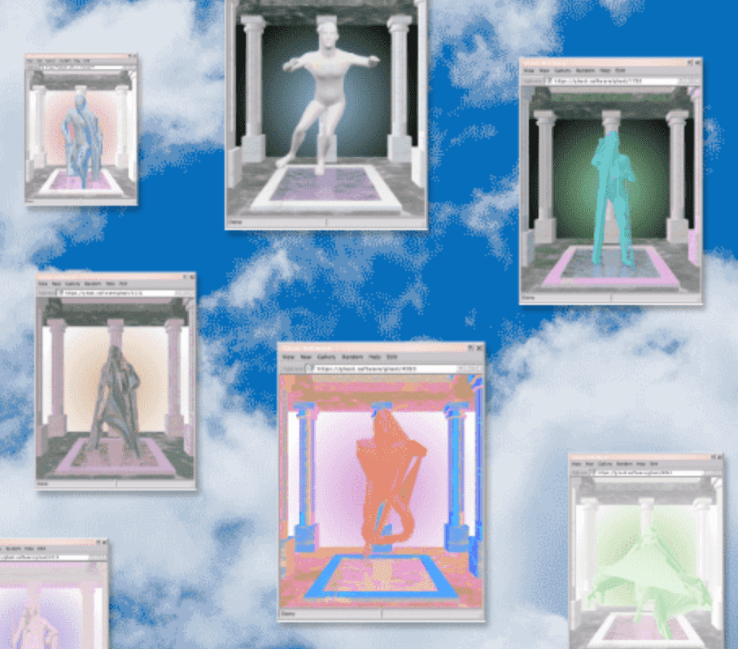

# HeavenComputer

欢迎来到 GodObserver™ 网页！

单击下面的按钮以铸造代币，这些代币将授予您在航天飞机上进行秘密任务的访问权，以部署和操作革命性的 GodObserver™ 望远镜，或单击此处了解有关我们研究的更多信息。

使用连接向导图标将您的钱包连接到 mint铸造你的上帝

HeavenComputer NFT 在过去 7 天内售出 36 次。HeavenComputer 的总销售额为 1.88 万美元。一个 HeavenComputer NFT 的平均价格为 52.3 美元。有 3,002 名 HeavenComputer 所有者，总共拥有 8,577 个代币。

