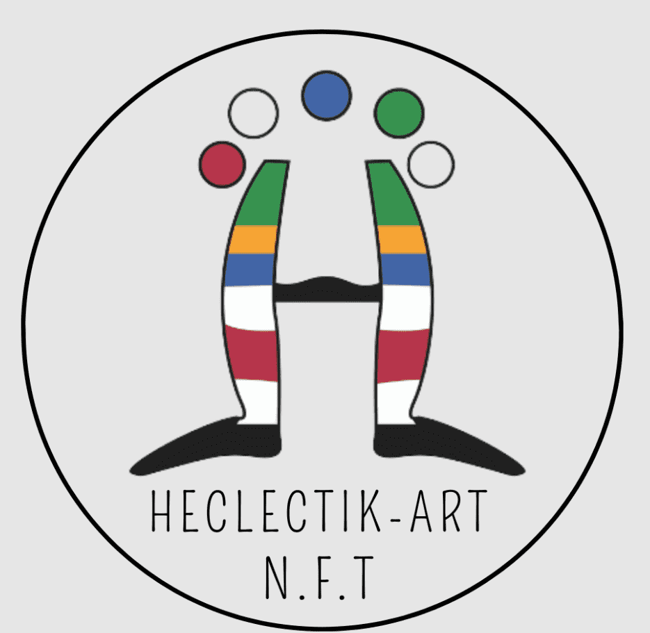

# Heclectik Art Showroom Metaverse Collection

在我们的 NFT 平台上以交互方式查看和出售当代作品。他们是具有不同技术、主题和概念的艺术家。20 多年来，葡萄牙的 Heclectik-Art 一直致力于专业的创作过程

Heclectik-Art 的诞生是为了给世界各地的视觉艺术家提供各种支持。超过 13 年，我们一直在国际艺术市场，努力照顾艺术家的形象，以及他的创作和需求。咨询我们，我们将始终有替代方案来实现您的目标。我们在年内定期开展：按时期/项目的策展指导和监督，国际展览 - 个人和团体 国际艺术展览和交易会\- 艺术品拍卖。艺术品编目，传记 - 生活和工作，投资组合- 网站程序集- 图像处理 

