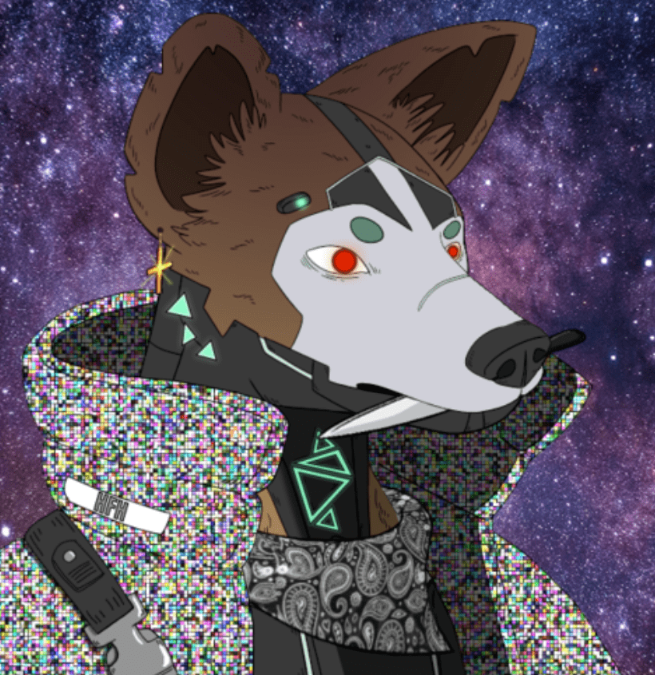

# Hedge Fund Hyenase

Hyena Den 是一个专门为提供 Web3 服务而构建的市场。在当前的 NFT 环境中，很难找到满足安全、智能合约、营销和其他基本需求的合法卖家。Hyena Den 旨在通过仅允许可信卖家进入 HFH 网络来解决这一挑战。Hyena Den 的愿景是通过提供可信赖的服务和消除被骗的担忧来填补 NFT 领域的空白。

对冲基金鬣狗是一个多链集合，成员来自 Polygon 和 Ethereum。我们一起建立了一个拥有更广泛知识的单一 HFH 社区。  

HFH 还能够跨区块链进行投资。无论是以太坊、Polygon、Solana、Cardano 还是更多，HFH DAO 都不仅限于投资单一网络。投资决策由社区做出，HFH DAO 属于社区，鬣狗代表股权。HFH 创始人促进了这一过程。HFH 致力于不断创新并为我们的持有者提供持续的价值。

