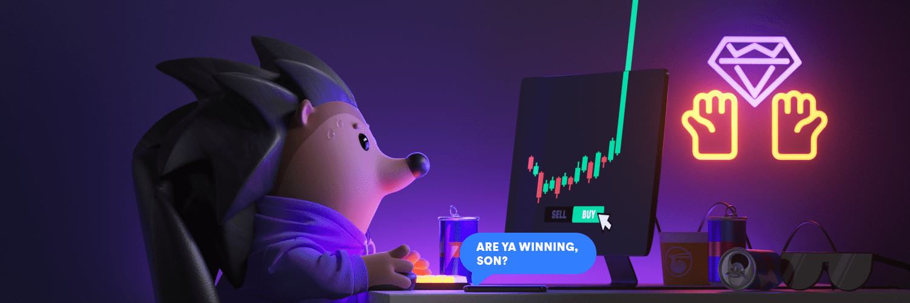

# Hedgies Official (H)

什么时候开始铸币？
初始分发将于 2022 年 2 月 1 日下午 3:00 UTC 开始。正在进行的分发将于 2022 年 2 月 8 日下午 3:00 UTC 开始，并且将在这个时间点进行披露。初始分配将分层，以使在 dYdX 上进行交易或投票的人受益。
谁能造一个？
dYdX 上的治理选民和交易者，最终公众（如果有的话）将能够铸造 Hedgies，作为 UTC 时间 2 月 1 日下午 3:00 开始的初始分配的一部分。
我为什么要持有一个？
对冲所有权将在 dYdX 交易所的用户资料下进行验证，并将作为 dYdX 协议的早期交易者和治理 参与者的身份。此外，每位持有 Hedgie 的用户还将在 dYdX 协议上获得 1 级的 $ DYDX 费用等级折扣（例如，持有大于或等于 5,000 美元的用户将获得 15% 的折扣（在 第 4 级）而不是正常的 10% 折扣（在第 3 层）。
费用是多少？
Minting Hedgies 只需要 gas，dYdX Trading Inc. 不会从该系列中收取版税。仅收取 2.5% 的版税

