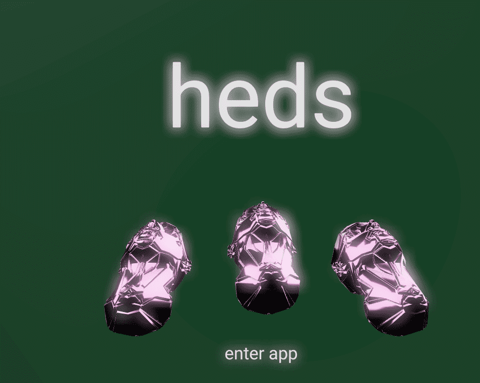

# hedsTAPE 02

Oshi 提交的原始样本用作此可视混音带的起源样本。磁带上的每一位艺术家，由 heds 策划，在他们提交的样本中至少有一秒钟的样本。这是铸造的 100 个版本中的 1 个。

Heds 最初是一个简单的 Twitter 群聊。10 名制作人，2 名软件工程师，1 个样本，以及一些简单的指南。没有流派限制。工程人员开始创建您今天看到的第一个版本的 heds 界面，而艺术家们则开始将一种完全前所未有的视听体验拼凑在一起。凭借绝对的意志力和致力于出版具有前瞻性的艺术作品，我们在 ETH 主网上发布了 hedsTAPE 01 合约。这启动了每月策展周期的模式。在每个周期中，我们都在测试创作协作艺术作品的意义的界限。

