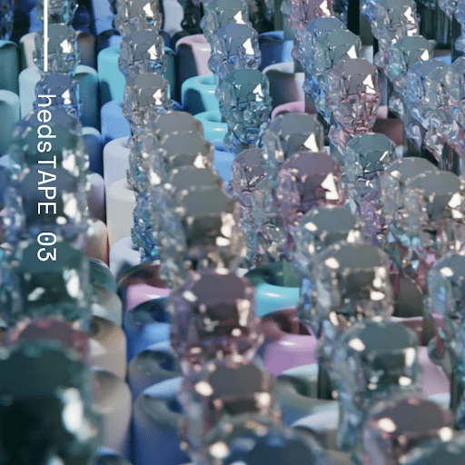

# hedsTAPE 03

Heds 最初是一个简单的 Twitter 群聊。10 名制作人，2 名软件工程师，1 个样本，以及一些简单的指南。没有流派限制。工程人员开始创建您今天看到的第一个版本的 heds 界面，而艺术家们则开始将一种完全前所未有的视听体验拼凑在一起。凭借绝对的意志力和致力于出版具有前瞻性的艺术作品，我们在 ETH 主网上发布了 hedsTAPE 01 合约。这启动了每月策展周期的模式。在每个周期中，我们都在测试创作协作艺术作品的意义的界限。

艺术家创建并提交自己的曲目，仅符合 bpm 并使用至少 1 秒的样本。提交应在 60 到 70 秒之间，因为最终提交将被混合到最终磁带中。得票最多的 20 份提交将被发送给样本策展人，样本策展人将选择最后 10 份提交的磁带。如果这个数字小于 20，则管理步骤将移至样本提供者，并且国库中的 ETH 将平均分配给提交者。

