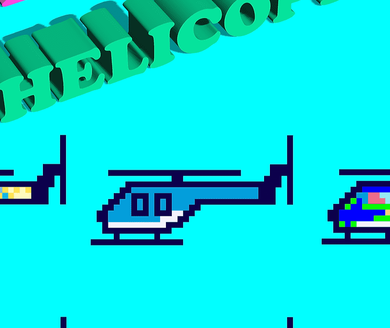

# HELICOPTERRR

什么是直升机？
Helicopterrrs 是基于 meme 歌曲“helicopterrr 直升机”的 NFT。直升机存储在多边形区块链上。与 BoredApes 或 CryptoPunks 一样，它们是随机生成的，具有自己独特的颜色属性。没有 2 架直升机是相同的。 
直升机是如何创建的？
HELICOPTERRRS 由我们的艺术家 Sahil Sarki 手绘。他以数字方式创建了每个特征，我们随机生成它们。有些比其他更罕见，但没有 2 个是相同的。
有多少架直升机？
永远只有 6666 个。
我为什么要为 jpeg 付费？
你不只是为艺术买单。您将拥有 1 张门票的数字所有权，为您提供终身独家内容。

