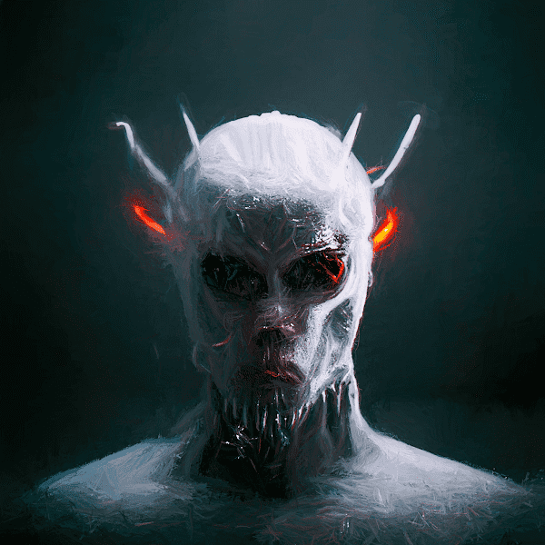

# Helloids

Helloids 统计数据
创建于 3 个月前
333代币供应
6.66% 费用
过去 7 天没有出售 Helloids。

使用 midjourney AI + Photoshop 中的重绘制作的 333 个 Hellish PFP。每一个都是手工编辑的。由 Ozbren 创建。▶ 什么是 Helloids？
Helloids 是一个 NFT（不可替代令牌）集合。存储在区块链上的数字艺术品集合。
▶ 有多少 Helloids 代币？
总共有 333 个 Helloids NFT。目前 260 位所有者的钱包中至少有一个 Helloids NTF。
▶ 最昂贵的 Helloids 销售是什么？
售出的最昂贵的 Helloids NFT 是 Helloids #082。它于 2022-06-13（3 个月前）以 22.8 美元的价格售出。
▶ 最近卖了多少Helloids？
过去 30 天内售出了 21 个 Helloids NFT。
▶ Helloids 的价格是多少？
在过去 30 天里，Helloids NFT 最便宜的销售额低于 4 美元，最高销售额超过 20 美元。过去 30 天内，Helloids NFT 的中位价格为 10 美元。

