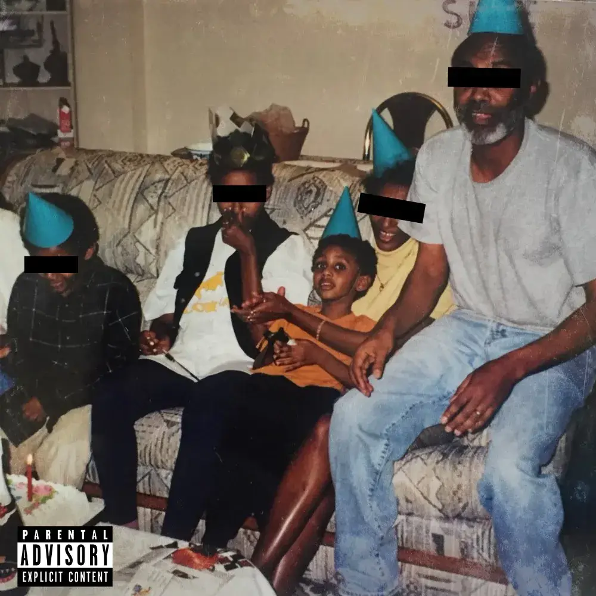

# Heno.

海诺。统计数据,
创建于 8 个月前
75 代币供应
10% 费用
没有海诺。在过去 7 天内售出。你们都准备好了吗？？ 🎥🍿

由 Heno 创建。关于声音.xyz,▶ 什么是 Heno.？
海诺。是一个 NFT（不可替代代币）集合。存储在区块链上的数字艺术品集合。
▶ 多少 Heno。代币存在吗？
总共有 75 个 Heno。NFT。目前，69 位业主至少拥有一台 Heno。NTF 在他们的钱包里。
▶ 多少 Heno。最近有卖吗？
有 0 Heno。过去 30 天内售出的 NFT。

