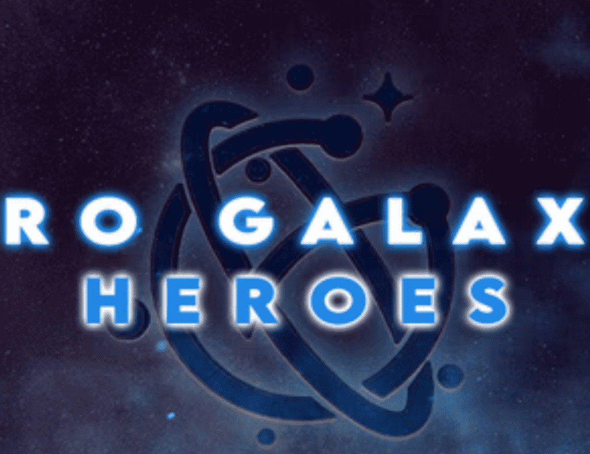

# Hero Galaxy Heroes

真实拥有者数量 2100+ - 5,000/5,555 英雄，截至 5/25
英雄 NFT 是英雄银河的本地居民，充当可玩的游戏内化身。
Hero NFT 是 5,555 个可生成的 ERC-721 NFT 的集合，在公开可用的加密游戏生态系统中具有大幅提升的游戏内统计数据，受益于整个生态系统的增长。
所有英雄 NFT 均由随机生成的稀有度可变的属性组成，可以装备各种类型的武器、盔甲、服装和配饰，称为神器——通过他们在游戏场上的荣耀而获得

