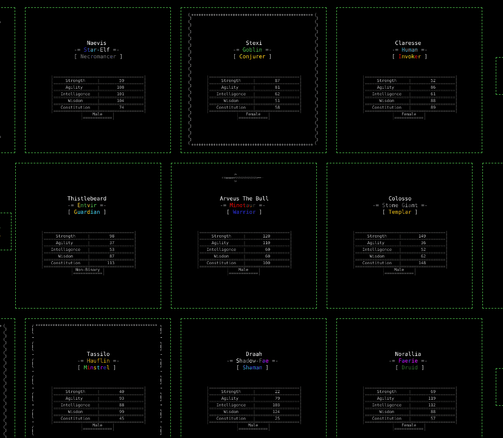

# Heroes of Evermore

随着预言的实现，Evermore 是一个处于危险动荡中的领域。随着恶魔大军从传送门涌入地狱领域，曾经被认为是安全和防御良好的土地已经从内部被腐蚀了

Battle for Evermore 是一款基于文本的 NFT 冒险游戏，对有史以来最伟大的游戏类型 MUD 进行了现代改编。Evermore 不同于任何其他基于文本的世界，它是一款基于团队的游戏，玩家为控制一个区域而战。来自光明与黑暗的英雄在竞争激烈的战场上对峙，争夺统治地位、荣耀和战利品。

通过多年的浪费和过度消费，人类统治并毒化了这片土地。平静的日子过去了，现在这个国家陷入了由人类国王灭亡引起的恶性战争。真空和随后的混乱引发了一系列残酷的争夺领土控制权的战斗。很明显，双方都不会讲道理。每个英雄都会为自己的事业而战，只有你能决定你的命运！地表居民称自己为光之英雄，人类和民众聚集在一起支持社会和社区。他们与他们的对手形成鲜明对比。在表面的外壳之下，力量和贪婪是黑暗中唯一的规则。

