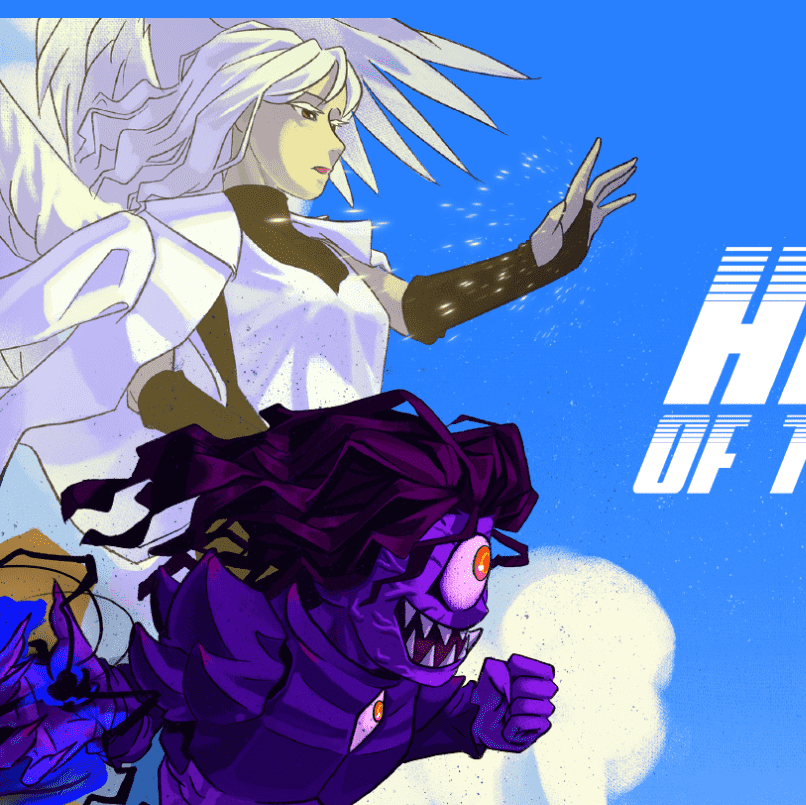

# Heroes of the Klay Official

克雷英雄Hiocle是一门由6000名英雄和反派组成的生成艺术，
具有分为英雄派和反派的特点。
Hiocle 的核心主题是“艺术品”和“社区”，这是 NFT 的精髓。
从久经考验的插画家 Yellow 的指尖诞生的迷人英雄和恶棍，
为持有者提供最高品质的艺术品。
我们计划通过一个人根据自己的性格所属的派系来强调归属感，并
建立一个子公会系统，即使是一个小社区也可以运作，
从而最大化持有者之间的社区权力。
之后，我们计划通过为每个阵营提供治理功能来提供项目的所有权，
并且在 V2 项目中，我们计划通过进入以太坊链来扩展到全球项目

