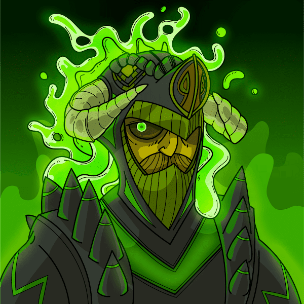

# Heroes of the Metaverse: The Last Essence

元宇宙英雄：最后的本质数据
创建于 2 个月前
6,600 代币供应
5% 费用
元宇宙英雄：最后的精华 NFT 在过去 7 天内售出 25 次。《元界英雄：最后的精华》的总销量为 86.4 美元。元界英雄：最后的本质 NFT 的平均价格为 3.5 美元。有 2,514 位元界英雄：最后的本质拥有者，拥有 6,600 个代币的总供应量。

一个关于魔法、幻想、英雄、地下城和龙的去中心化故事 什么是元宇宙英雄：最后的本质？
元宇宙英雄：最后的本质是一个 NFT（不可替代令牌）集合。存储在区块链上的数字艺术品集合。
▶ 元宇宙英雄：最后的精华代币有多少？
总共有 6,600 位元宇宙英雄：最后的本质 NFT。目前，2,514 位所有者的钱包中至少有一个《元宇宙英雄：最后的精华》NTF。
▶ 元宇宙最贵的英雄：最后的精华特卖是什么？
元宇宙最昂贵的英雄：最后出售的精华 NFT 是 Archer 96。它于 2022-06-17（2 个月前）以 225.2 美元的价格售出。
▶ 元界英雄：最后的精华最近卖出了多少？
过去 30 天内售出了 471 个元宇宙英雄：最后的精华 NFT。
▶ 元宇宙英雄：最后的精华需要多少钱？
在过去 30 天里，最便宜的元界英雄：最后的精华 NFT 销售额低于 2 美元，最高销售额超过 11 美元。过去 30 天，《元宇宙英雄：最后的本质》NFT 的中位价格为 7 美元。

