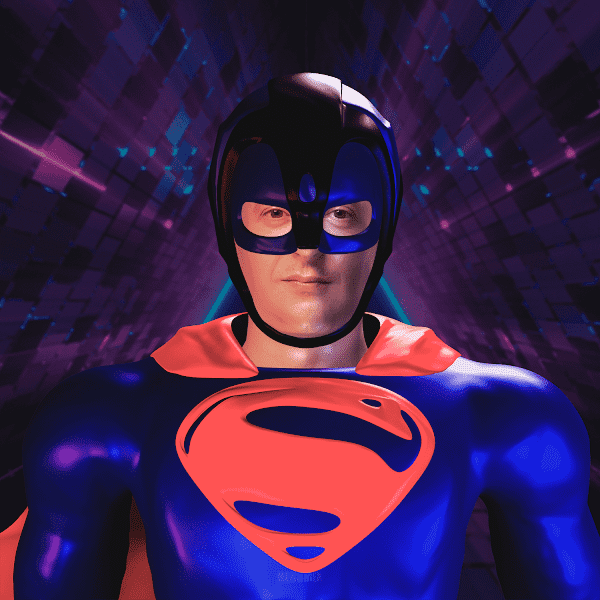

# HEROMIX Comics: Zelensky

发射
这是我们将完成的地方
Stripes NFT YouTube 系列和
启动铸币平台。HEROMIX：NFT 系列漫画英雄形象中的乌克兰总统 Volodymyr Zelenskyy。制作于 2022 年，以表达对战争时期乌克兰人民的声援。“像世界上大多数人一样，我很震惊地看到乌克兰现在发生的事情。我的心与成千上万因一场毫无意义的战争而逃离家园的无辜人民同在。坐在半个地球的另一边，我感到无助，但不得不行动和创造。在我的 NFT 收集社区的推动下，我知道我可以以某种方式提供帮助。所有 NFT 销售额的 10% 将进入乌克兰官方加密捐赠钱包

