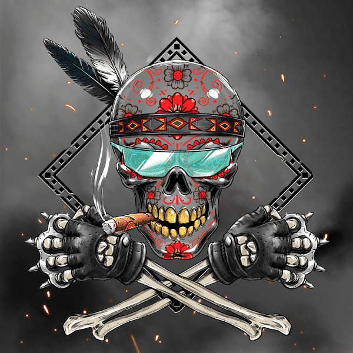

# Hewer Clan

Hewer DAO 是一个社区驱动的收藏品 NFT 项目，也是第一个在其社区金库中添加 CryptoPunk 的 NFT 集合。凭借后世界末日的氛围，我们的 Hewer Tag NFT 由许多不同的特征组成，这些特征使每个 Tag 都显得特别而酷炫。每个 Hewer Tag 都是以太坊区块链上唯一的、不可替代的代币 (NFT)。

持有 Hewer 标签可让您参与协调 Hewer 社区财政。在我们于 8 月 26 日公开发售后，该国库以 232 ETH 为种子。

在更名之后，我们之前的路线图被关闭了。新的路线图项目将由标签持有者决定。凭借社区成员的深刻见解和想法，再加上 Hewer 委员会，我们相信我们可以让 Hewers 茁壮成长。

通过我们的 Twitter 和 Discord 关注我们的旅程和进展！DAO 一词最近在 NFT 领域中反复出现，它代表“去中心化自治组织”，这意味着没有中心人物。Hewer DAO，前身为 Hewer Clan，由社区所有，旨在收购价格可能会随着时间推移而升值的优质 NFT 项目，从而增加国库价值。随着财政部的增加，将出现更多发展项目的机会。

为什么要成为Hewer？

您将积极参与社区金库的管理，建议增加新项目，以及何时退出某些职位的最佳时机。还被在这个领域有经验的社区成员包围，分享知识，并获得如何分析和寻找好的 NFT 项目的见解。由于您将有许多社区成员建议将项目添加到金库中，因此如果您想找到好的机会和具有巨大潜力的 NFT 项目，我们的持有人专用频道可能是您的去处。最重要的是，其他项目通常会在发布时为 Hewer Tag 所有者提供白名单。因此，您可以在这些白名单中找到一些宝石，而不必在毒气战争中挣扎……

