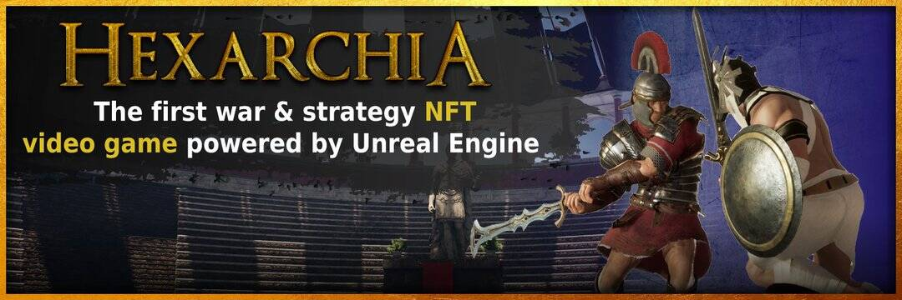

# Hexarchia Equipment

Hexarchia 是一款受国际象棋启发的战争与战略视频游戏，您可以在其中收集并与有史以来最伟大的人物和文明进行战争。玩家可以赚取游戏内资源并将其换成真钱。关于游戏
灵感来自国际象棋和历史上最伟大的文明。 军阀和皇帝在扣人心弦的战斗中相互冲突，争夺极乐世界的统治地位，这是游戏设定的神话世界。▶ 什么是Hexarchia设备？

Hexarchia Equipment 是一个 NFT（不可替代代币）集合。存储在区块链上的数字艺术品集合。

##### ▶ Hexarchia Equipment 代币有多少？

总共有 1,000 个 Hexarchia Equipment NFT。目前 507 位所有者的钱包中至少有一个 Hexarchia Equipment NTF。

