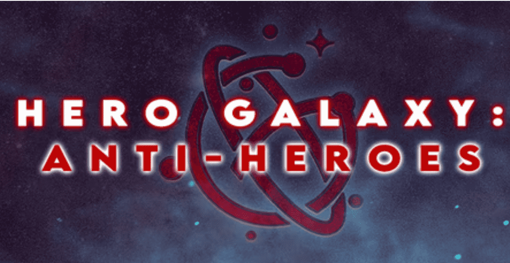

# Hero Galaxy Anti-Heroes

 因此，我们永远不会期望 6666 的完整收藏大小达到。**
反英雄是英雄银河英雄 NFT 的死敌。
Anti-Heroes 是一组生成的 ERC-721 NFT，使游戏玩家能够通过 Hero Galaxy 的游戏赚取游戏生态系统中的游戏玩法获得提升的奖励，通过各种其他机制获得被动奖励。
使用 Anti-Hero 薄荷通行证，可以永久铸造 Anti-Heroes，总收藏量可达 6,666反英雄是 Utiliti Genesis Hero NFT 的死敌。 反英雄薄荷通行证可以通过将 5 个宝箱神器（作为奖励掉落在英雄身上）放入Forge或通过在OpenSea上购买来获得。 Anti - Heroes 是一组生成的 ERC-721 NFT，最初作为英雄银河原版旗舰游戏中的反派发布，旨在降低进入生态系统的门槛，价值为英雄价格的 1/4，+ 持有者免费掉落

