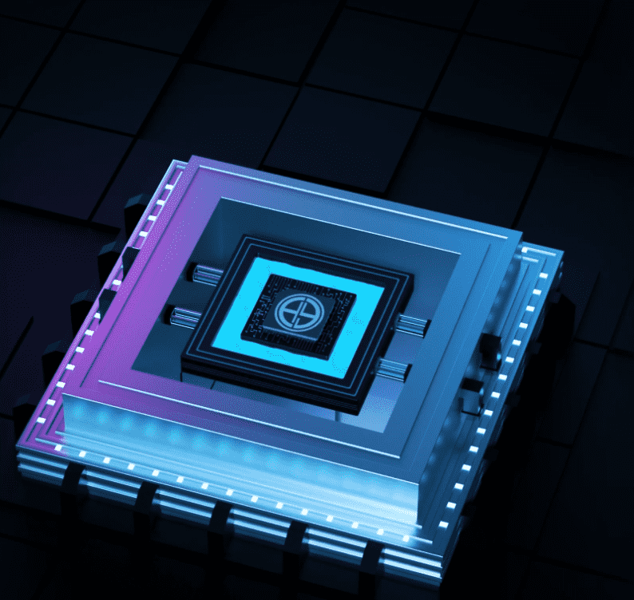

# Hegemony NFT

Hegemony 是一个赛博朋克风格的集合，包含 7777 个超逼真的 3D 渲染头像，将为您提供对我们不断发展的生态系统的独家访问权限。
生活在以太坊区块链上，每个 NFT 都将授予您访问由专家网络支持的不断增加的实用程序列表。持有人还可以通过参与各种生态系统的机制来赚取被动收入。加入我们，并访问一个不断发展的社区，该社区具有指数级的现实生活价值和好处。
Hegemony 通过透明度和良好的商业实践寻求对 NFT 行业的积极影响。

