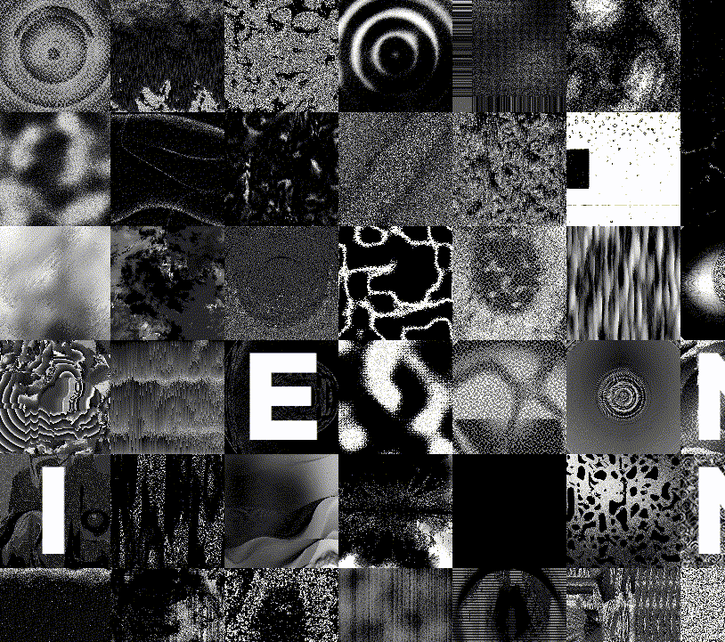

# HIDDEN IN NOISE

噪音是另一种感知形式。它是视觉和听觉形式中最抽象的一种。简单和复杂的生成器都用于生成 Hidden in Noise 集合：渐变、perlin 和白噪声，以及一些定制的生成器。

生成器的输出以多种方式以随机顺序与随机数学运算相结合。这就是混沌的秩序。

HIDDEN IN NOISE NFT 在过去 7 天内售出 38 次。HIDDEN IN NOISE 的总销售额为 $17.3k。HIDDEN IN NOISE NFT 的平均价格为 455.2 美元。有 569 位 HIDDEN IN NOISE 所有者，拥有 1,024 个代币的总供应量。

