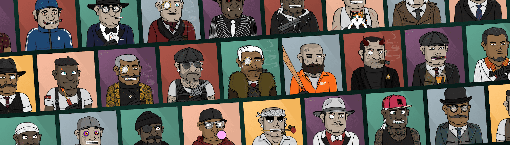

# High Crime Society NFT

那些角色

认识 HCS 成员
高犯罪协会是 8,000 名算法生成的独特 HCS 成员，拥有超过 130 种不同的手绘特征。

HCS 成员的长相从街头混混到绅士不等。它们都有一个由所有 Boss 中的 Boss 分配的等级，这会影响它们的外观。传说

什么是重罪社会？
多年来，元宇宙正在迅速扩张，许多企业正在蓬勃发展。猿、狮子和朋克目前在二级市场上处于垄断地位，所有老板的老板不喜欢这种小丑。这就是为什么他召集了元宇宙中所有不同的犯罪组织，从而建立了高犯罪协会。

所有Boss中的Boss，不在乎他的队伍中哪个家族最强大。他将在他的 8,000 名最值得信赖的成员中分配不同的级别，并期望对他的协会完全忠诚、荣誉和尊重。

