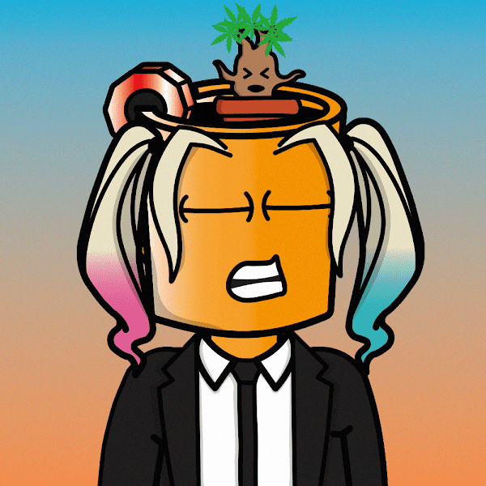

# High Lights Official

NFT 收藏
包括 4,420 个收藏夹打火机
，使其在以太坊区块链上保持点亮
传播光
这个项目不仅仅是关于吸烟文化。

它有更深的意义

这个项目是由热情的个人组成的，他们的使命是“高光”其他涂料艺术家和 web3 空间中的项目。High Lights 项目旨在为 NFT 和 web3 空间中其他令人惊叹的艺术家和项目带来光明。

我们想要“突出”其他人的方法之一是在集合中进行一些社区贡献。

发布后请密切注意社区创建的 1/1 和将存在于集合中的特征。King Flame - King Flame 是由创造这个梦幻般的 IRL 3D 模型

的唯一OGRE创造的。

铸造 King Flame 的人将直接将物理 3D 模型运送到他们的地址。

