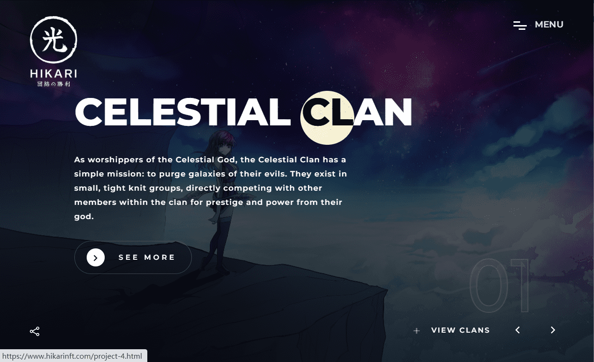

# Hikari NFT - Official

灵魂数：2,566

启动计数：2,9989 - 截至 22 年 12 月 8 日

Hikari Souls 可以通过我们的交互式网络体验 Gen-U 转移到“初始”中。

如何认领你的启蒙：


1.找到一个灵魂并检查其当前的Gen-U进度。一些灵魂将等待揭示，而其他灵魂可能已经部分玩过 Gen-U：这里

2.带着你的灵魂穿越Gen-U。在游戏中的行动决定了你的氏族、性别和其他特征：这里

3.在美国东部标准时间凌晨 4 点之前提交您的 Gen-U 数据，并在 24 小时内公布！

从 5,555 个灵魂开始，Hikari 是由 Jeez & ChainX 创建的“入门者”集合。

一个灵魂的能量可以转移到一个新人中并在 Gen-U 体验中提升。最终的艺术作品是根据游戏中的决策数据生成的。

持有者可以访问我们的 MOBA：Hikari 传奇中的未来系列、空投、漫画、街头服饰和可玩角色。

欢迎来到不称职的家。

