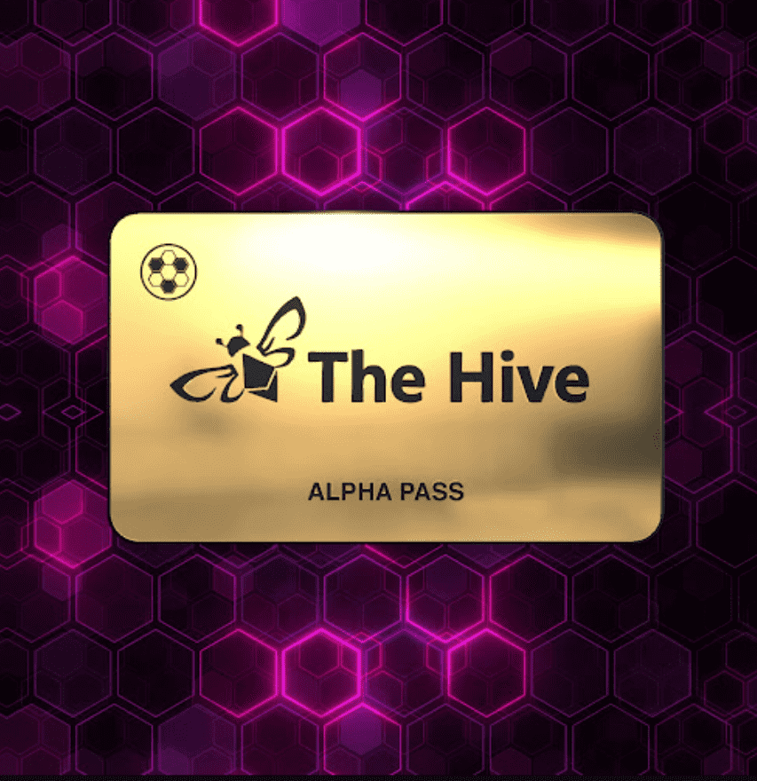

# Hive Alpha

通过 Alpha Pass，您有权享受高级 Hive 福利，包括：访问提供市场洞察、趋势和 alpha 报告的独家工具访问独家 Hive Alpha Discord，包括：主要 Alpha 通道紧急和临时警报频道关于现在正在铸造的东西的警报德根打法（高风险）访问我们从基础到高级的加密课程和教程访问有关 NFT 买卖策略的私人视频和流媒体白名单赠品和图纸的条目白名单或提前访问未来的收藏

Hive Alpha 是一个 NFT（不可替代令牌）集合。存储在区块链上的数字艺术品集合。总共有 2 个 Hive Alpha NFT。目前，239 位所有者的钱包中至少有一个 Hive Alpha NTF出售的最昂贵的 Hive Alpha NFT 是 [Hive Alpha Pass它于 2022 年 6 月 26 日（2 个月前）以 196.5 美元的价格售出。

