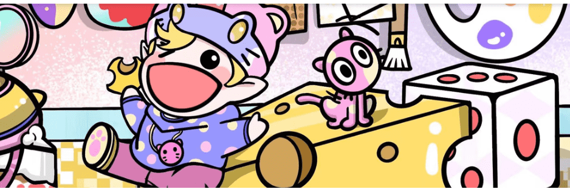

# HobgoblinNFT

HobgoblinNFT NFT 在过去 7 天内售出 6 次。HobgoblinNFT 的总销售额为 29.64 美元。一个 HobgoblinNFT NFT 的平均价格为 4.9 美元。有 1,190 个 HobgoblinNFT 所有者，拥有 5,555 个代币的总供应量。

Hobgoblin NFT 是 5555 个独特的 Hobgoblin NFT 的集合——生活在以太坊区块链上的独特数字收藏品。我们在这里很开心，很开心，喜欢聚会，做开心的事情。社区可以通过路线图激活来解锁未来的领域和福利。

▶ 什么是 HobgoblinNFT？
HobgoblinNFT 是一个 NFT（Non-fungible token）集合。存储在区块链上的数字艺术品集合。
▶ 有多少 HobgoblinNFT 代币？
总共有 5,555 个 HobgoblinNFT NFT。目前，1,190 位所有者的钱包中至少有一个 HobgoblinNFT NTF。
▶ 最昂贵的 HobgoblinNFT 销售是什么？
售出的最昂贵的 HobgoblinNFT NFT 是 . 它于 2022-06-12（3 个月前）以 237.2 美元的价格售出。

