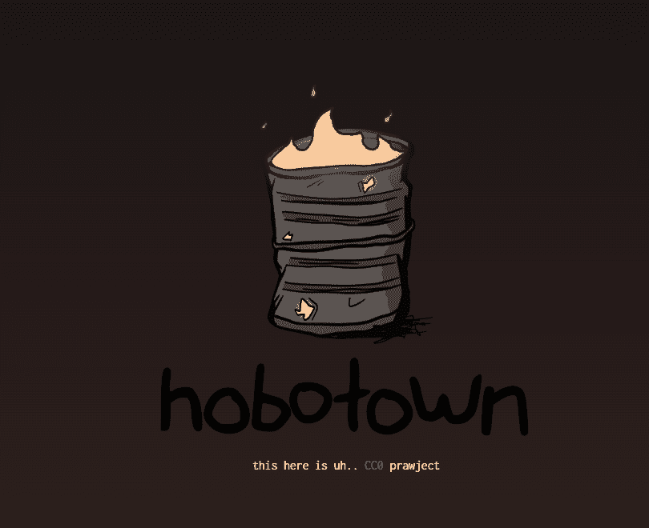

# hobotown.wtf

▶ 什么是 hobotown.wtf？
hobotown.wtf 是一个 NFT (Non-fungible token) 集合。存储在区块链上的数字艺术品集合。
▶ 有多少 hobotown.wtf 代币？
总共有 6,900 个 hobotown.wtf NFT。目前，3,047 位所有者的钱包中至少有一个 hobotown.wtf NTF。
▶ 最昂贵的 hobotown.wtf 销售是什么？
最昂贵的 hobotown.wtf NFT 是 hobotown #5379。它于 2022 年 6 月 11 日（3 个月前）以 240 美元的价格售出。
▶ 最近卖了多少hobotown.wtf？
过去 30 天内售出了 5,259 个 hobotown.wtf NFT。
▶ hobotown.wtf 需要多少钱？
过去 30 天，最便宜的 hobotown.wtf NFT 销售额低于 49 美元，最高销售额超过 181 美元。过去 30 天 hobotown.wtf NFT 的中位价格为 108 美元。

