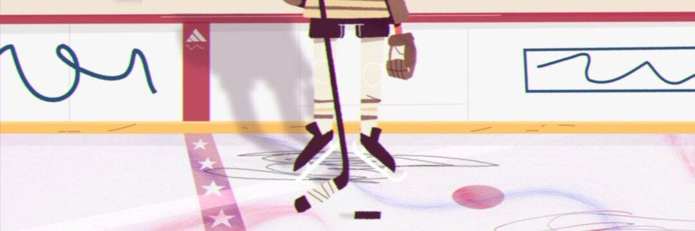

# Hockey Town

你决定我们创造什么。
对于每场比赛，在所有 10 张牌中哪个角色卖得最快，我们将从该团队中创建一个额外的角色以在下一轮“上场”。

没有真正的“赢家”和“输家”——只是每个团队或多或少地创造了一些角色。出于对后果的恐惧，全球每个人都放弃了他们正在做的事情并组建了他们的团队。只有 30 分钟的准备时间，团队疯狂地使用找到的物品来制作临时设备和制服。当我们完成所有 16 次投放后，实体曲棍球卡将由“玩家”签名并装在一个漂亮的塑料盒中邮寄给任何收集 NFT 的人。

🥇 金币 - 如果您从在第 1 轮赢得冠军的球队中收集/持有一名球员，您将获得该系列中所有 30 张牌的完整包。

