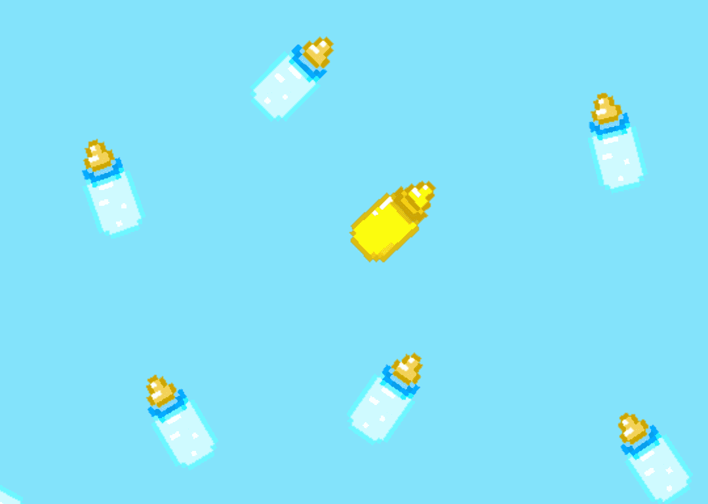

# HODL Bottles

HODL 瓶子用于创建 OG 2D Junior Punk 的突变 3D 版本。才华横溢的 Cinque Holliday 的艺术作品。

▶ 什么是 HODL 瓶？
HODL Bottles 是一个 NFT（不可替代代币）集合。存储在区块链上的数字艺术品集合。
▶ 有多少 HODL Bottles 代币？
总共有 1,300 个 HODL Bottles NFT。目前，629 位所有者的钱包中至少有一个 HODL Bottles NTF。
▶ 最昂贵的 HODL 瓶销售是什么？
出售的最昂贵的 HODL 瓶 NFT 是 HODL 瓶 #977。它于 2022 年 7 月 3 日（2 个月前）以 109.8 美元的价格售出。
▶ 最近卖出了多少 HODL 瓶？
过去 30 天内售出了 15 个 HODL Bottles NFT。
▶ HODL 瓶要多少钱？
在过去 30 天内，最便宜的 HODL Bottles NFT 销售额低于 65 美元，最高销售额超过 110 美元。在过去 30 天内，HODL Bottles NFT 的中位价格为 82 美元。

