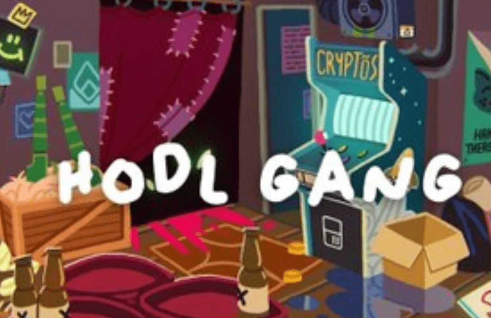

# HODL GANG

HODL GANG 是一个 NFT（Non-fungible token）集合。存储在区块链上的数字艺术品集合。
▶ 有多少 HODL GANG 代币？
总共有 2,999 个 HODL GANG NFT。目前，1,089 位所有者的钱包中至少有一个 HODL GANG NTF。霍德尔帮经过 hodlgang项目在这里加入新的Discord。在这里检查稀有度。Hodl Gang 是第一个随机生成的步行 NFT 项目，在以太坊区块链上启动
HODL GANG 是以太坊区块链上以编程方式随机生成的 NFT 集合。该系列由 3,000 名随机组装的动画帮派成员组成，共有超过 30 万个选项。每个 HODL GANG 成员都由独特的身体、头部、面部、服装和配饰组成。

