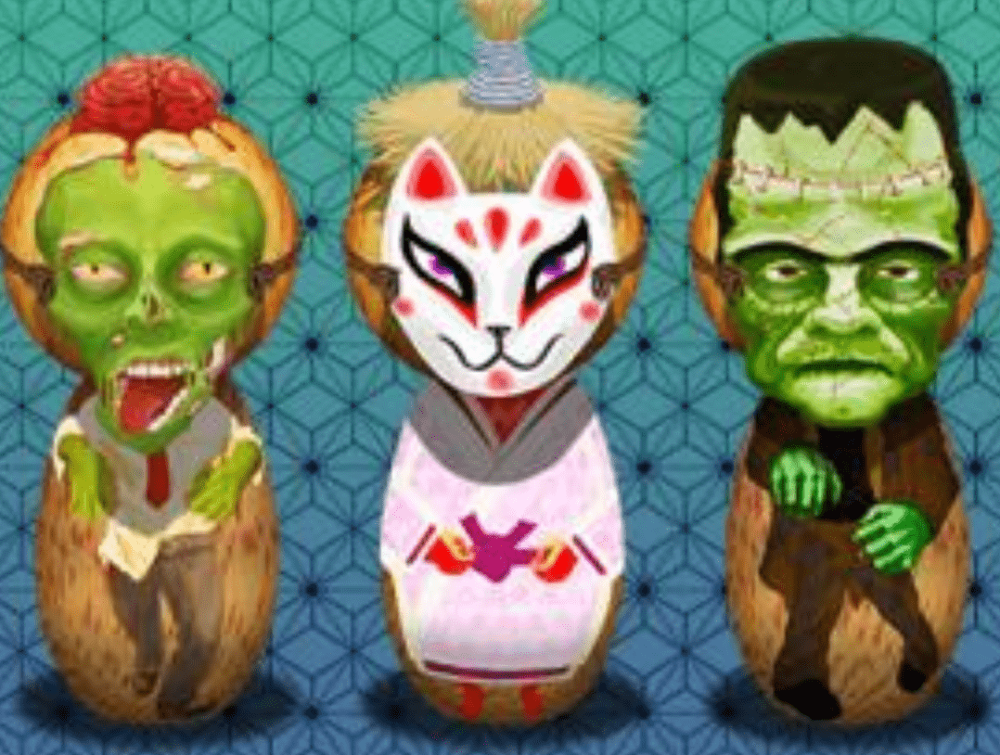

# Holidaze V2

Holidaze 艺术发布是基于假日季节的演变。三位特色艺术家，三个假期，都在一个 Holidaze 令牌下

万圣节系列的主题 kokeshi 是来自日本的木制娃娃。它们是江户时代的旧玩具，是给孩子们的东西。他们很巧妙。只需几块木头和一点油漆，它们就会变成你想要的任何东西。它们的形式非常简单，就像原型的 Hello Kitty。只需添加油漆，您就有了僵尸、狐狸或弗兰肯斯坦的怪物。

▶ 什么是 Holidaze V2？
Holidaze V2 是一个 NFT（Non-fungible token）集合。存储在区块链上的数字艺术品集合。
▶ 有多少 Holidaze V2 代币？
总共有 10 个 Holidaze V2 NFT。目前 5 位所有者的钱包中至少有一个 Holidaze V2 NTF。
▶ Holidaze V2 最近卖出了多少？
过去 30 天内售出 0 个 Holidaze V2 NFT。

