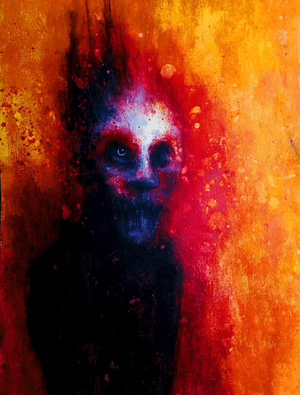

# Hollow Genesis

空心创世纪统计
创建于 11 月前
55代币供应
5% 费用
过去 7 天没有销售 Hollow Genesis。

“创世纪”是Hollow的合集。

创世纪几个环节的作品和数字的原创作品，创造了具有错误和不同用途的独特变化，无法识别原件的独特变化。

它专注于探索人类思想中最深刻的奥秘，典型是人类的绘画和变形。

水彩钢笔和作品的主体通常是他原创的主要表现形式。Hollow Genesis 是一个 NFT（非同质代币）集合。存储在区块链上的数字艺术品集合。

