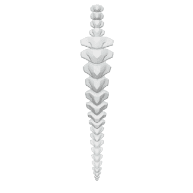

# HOLOGENETIX

HOLOGENETIX 统计数据
创建于 3 个月前
3,680代币供应
10% 费用
HOLOGE过去的HOLOGEIX的总价格为7NFT。ENETIX的总价为54954.89919的一个HOLOGEIX的总价格为1美元。HOLOGEIX的一个总价格为4美元，855美元。

图腾演绎：

Hologenetix 是一个由 8,888 个 NFT 脊椎的造型集合，它们与 XOiD 一起推动者的化身系统中着重要。获得 Hologenetix 脊椎后发挥的作用，您将获得 NFT，该 NFT 组成图腾进一步扩展的扩展的未来实用性/Web3 中具有即时实用性，我们拥有更多用例。此外，我们还可以拥有更多用例，可以单独的“显示程序在 Holo 中提供内容”。的平台和 DAO 中发声的机会。

