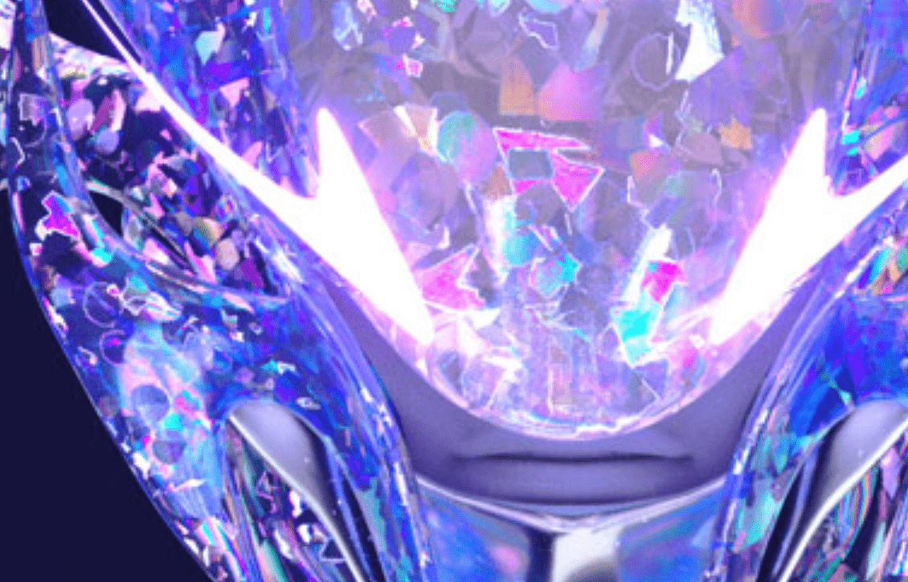

# Holo Things

所有东西全息和稀有。100 个全息物体描绘权力、尊重、皇室和风格。

▶ 什么是 Holo Things？
Holo Things 是一个 NFT（不可替代代币）集合。存储在区块链上的数字艺术品集合。
▶ 有多少 Holo Things 代币？
总共有 47 个 Holo Things NFT。目前，194 位所有者的钱包中至少有一个 Holo Things NTF。
▶ 最昂贵的 Holo Things 销售是什么？
出售的最昂贵的 Holo Things NFT 是 #024 - Holo x R66。它于 2022-08-04（30 天前）以 91.4 美元的价格售出。
▶ 最近卖出了多少 Holo Things？
过去 30 天内售出了 1 个 Holo Things NFT。

