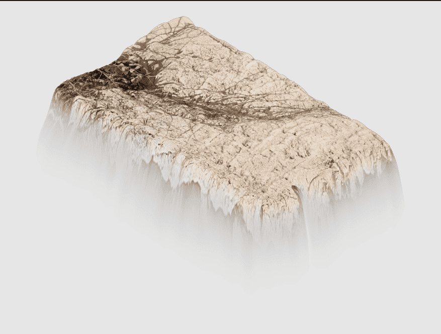

# Holy Rock NFT Project

Holy Rock NFT 是一个独家社区项目，将商业世界和技术进步与犹太信仰和精神相结合。该项目的基础是一项全球独一无二的首创计划：使用数字技术创建西墙石头的精确详细成像。西墙的石头已有数千年的历史。每块石头都有其独特的外观、尺寸、重量、形状和年龄。一些石头特别突出和稀有，因为它们巨大的尺寸或嵌入其中的不寻常的铭文。圣石数量有限，只有 2357 块可用。该项目的基础是一项全球独一无二的首创计划：使用数字技术创建西墙石头的准确成像。

西墙的石头已有数千年的历史。每块石头都有其独特的外观、尺寸、重量、形状和年龄。一些石头特别突出和稀有，因为它们巨大的尺寸或嵌入其中的不寻常的铭文。

Holy Rock NFT 社区项目的每个成员都将拥有和拥有一个模拟图像，与原始西墙石头之一相同。原石上存在的每一个裂缝、凿子和历史铭文都会出现在图像上。

每张图片都标有 NFT（Non-Fungible Token）代码，用于识别原创、独家和不可复制的数字作品。

