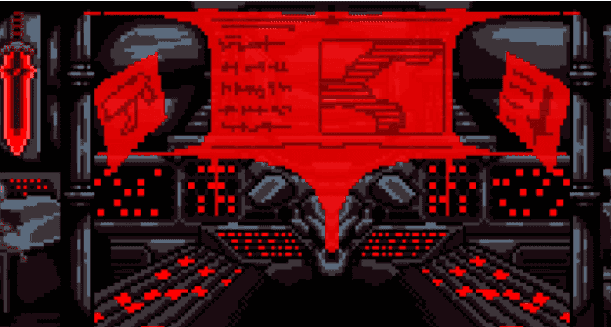

# Holy Villains

3,333 名恶棍加入游戏，赚取将彻底改变空间的视频游戏。

我们有一个积极而积极的社区，他们很高兴能将 MetaVerse 变得更好

▶ 什么是神圣反派？
Holy Villains 是一个 NFT（非同质代币）集合。存储在区块链上的数字艺术品集合。
▶ 有多少神圣反派代币？
总共有 3,329 个神圣恶棍 NFT。目前，1,538 位所有者的钱包中至少有一个 Holy Villains NTF。
▶ 什么是最昂贵的神圣反派销售？
售出的最昂贵的 Holy Villains NFT 是 Holy Villain #1814。它于 2022 年 6 月 23 日（2 个月前）以 329.3 美元的价格售出。
▶ 最近卖出了多少圣反派？
过去 30 天内售出了 70 个神圣恶棍 NFT。
▶ 一个神圣的反派要多少钱？
过去 30 天，Holy Villains NFT 最便宜的销售额低于 61 美元，最高销售额超过 153 美元。过去 30 天，Holy Villains NFT 的中位价格为 89 美元。

