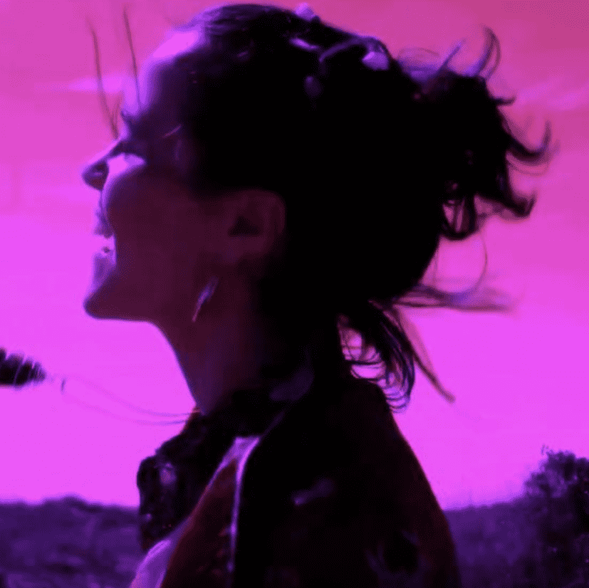

# Home - prod. saikochild.xyz

'Home' 是我两年前在家乡北卡罗来纳州威尔明顿市一个名为 Skooters 的老溜冰场拍摄的第一部音乐录影带。一个本地品牌@equalrightsapparel 为我打扮，本地摄像师@_rxcrm 拍摄并编辑了视频。我在打开的屏幕上设计了标志。当我们拍摄视频时，我们实际上在溜冰场的扬声器中播放了我的歌曲，我们录制时每个人都在滑着它。如果你注意到视频中我摔倒在相机上的部分，那是用手机相机拍摄的，但我们决定留下它，因为歌曲中的一句台词是“振作起来，看着他们的脸消失”。在录制这首歌的过程中，我留下了非常有毒的模式，有一段时间，我感到被旧的欲望和框架所困扰。音乐是我的救命之恩，它以所有最好和最坏的方式向我展示了我自己，它让我恢复了我的个性。我记得我第一次看这个视频时，我开始在所有人面前失控地哭泣。我觉得我们创造了一些真正神奇的东西，并且是我作为一个人的基础。我觉得我已经征服了这么多，只是让自己创造了如此惊人的东西。我想不出比向您展示我所有卑微的起点更好的方式来介绍自己进入 web3 领域。观看它让我有机会了解我作为一名音乐家在许多方面已经走了多远，我也迫不及待地想向其他人展示这种成长。这一滴是万里长征的开始~BECOMING~谢谢你陪我一起骑行，没有我爱的人和支持我的人，我什么都做不了，不仅在经济上，而且在精神上和智力上。向我最大的支持者和粉丝致敬我渴望治愈家庭创伤并踏上新的道路是我来到这里的原因，所以感谢我的妈妈 Liz 和我的祖母 May，我爱你，我迫不及待地想给你你给我的东西. 

