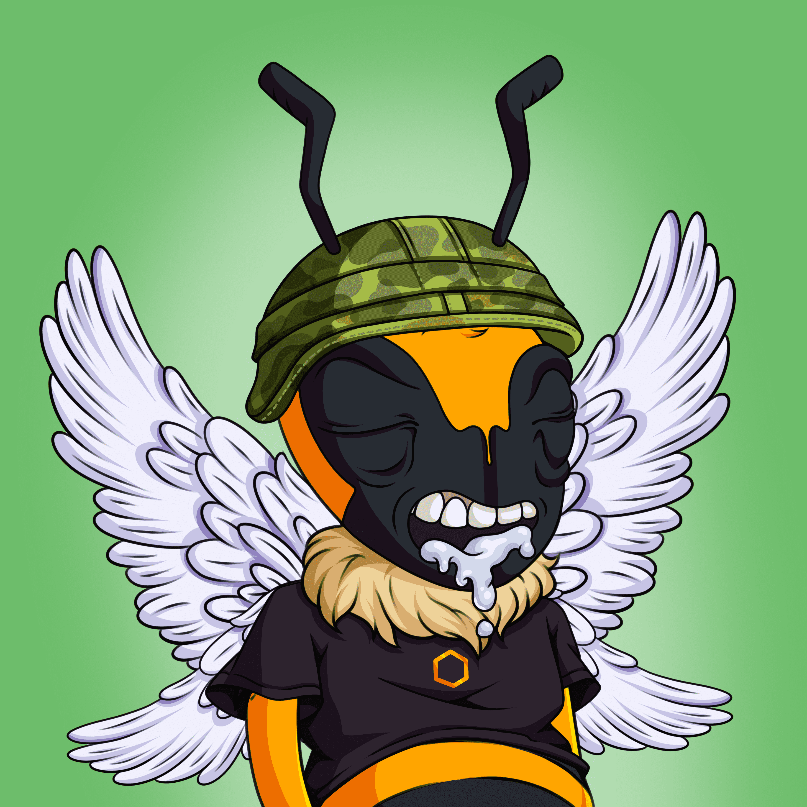

# Honey Bee Club Official

2043 年，宇宙中最后一个蜂群被传奇蜜蜂带到了人类和其他生物面前。 传说中的蜜蜂向人类寻求帮助，为最后一个蜂群的蜜蜂提供家园和庇护所，同时他们制定并执行一项计划以拯救他们的物种免于灭绝。 他们打算如何做到这一点还有待观察......

蜜蜂俱乐部官方NFT - 常见问题（FAQ）
▶ 什么是蜜蜂俱乐部官方？
Honey Bee Club Official是NFT（不可替代的令牌）集合。存储在区块链上的数字艺术品的集合。
▶ 有多少蜜蜂俱乐部官方代币存在？
总共有752个蜜蜂俱乐部官方NFT.目前有283个所有者在他们的钱包里至少有一个蜜蜂俱乐部官方NTF。
▶ 最近卖了多少蜜蜂俱乐部官方？
在过去的30天内，有0个蜜蜂俱乐部官方NFT售出。

