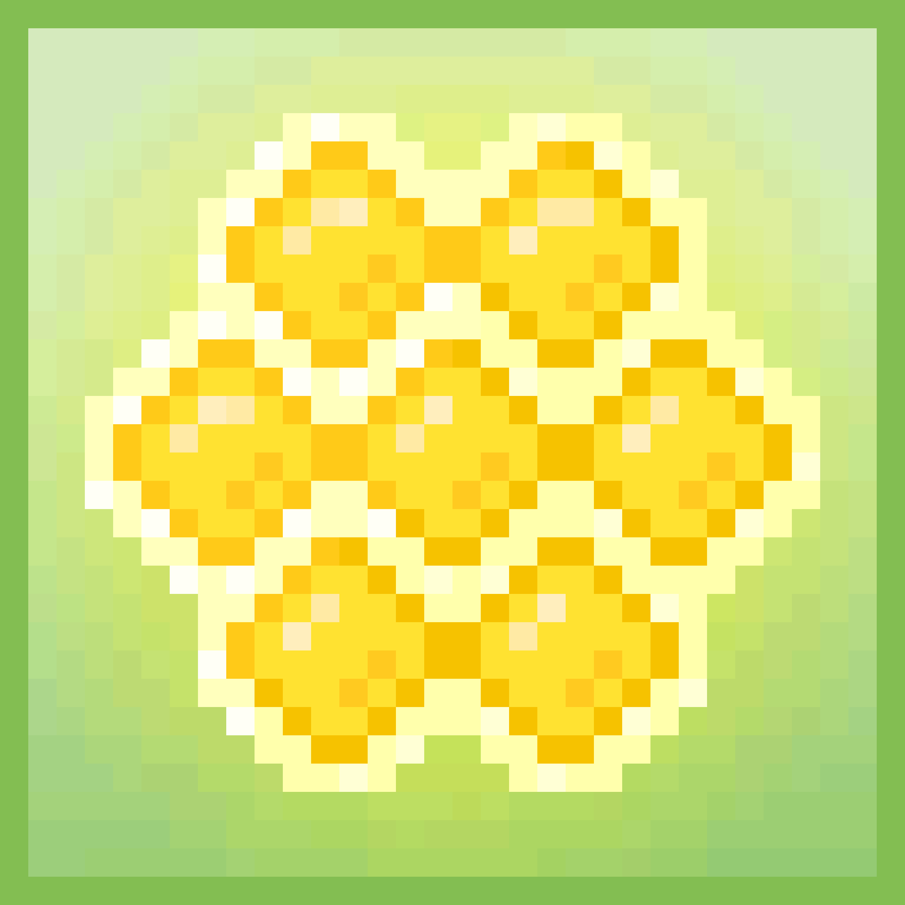

# Honeycombs Deluxe

Honeycombs Deluxe 是 Bears Deluxe 系列 NFT 的一部分。 使用它们来“升级”蜜蜂豪华版，在我们的网站上了解更多信息。

蜂窝豪华NFT - 常见问题（FAQ）
▶ 什么是蜂窝豪华版？
Honeycombs Deluxe是NFT（不可替代令牌）的集合。存储在区块链上的数字艺术品的集合。
▶ 有多少蜂窝豪华代币存在？
总共有5个蜂窝豪华NFT.目前有177个所有者在他们的钱包里至少有一个蜂窝豪华NTF。
▶ 最昂贵的蜂窝豪华促销是什么？
出售的最昂贵的Honeycombs Deluxe NFT是Uncommon Honeycomb。它在2022-06-27（2个月前）以$ 32.9的价格出售。
▶ 最近卖了多少只蜂窝豪华房？
在过去的30天内，有4个蜂窝豪华NFT售出。
▶ 什么是流行的蜂窝豪华替代品？
许多拥有Honeycombs Deluxe NFT的用户还拥有Bitz Club，Honey Hives Deluxe，Teen Ape Gang Mutants（TAGM）和Robotos Genesis。

