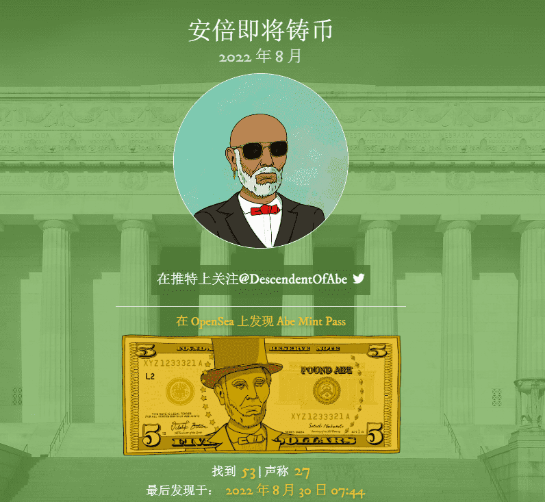

# Honorary Abes

安倍后裔是一个 NFT 项目，有 3 个重要目标。

向需要和应得的人提供现金

入职并激励新用户与 web3、nft、加密货币和数字资产生态系统进行交互

以更动态的方式创建社区和 PFP 项目。一种庆祝与菜鸟和 OG 一样给予和分享 NFT 旅程的方法。

安倍后裔将如何实现这些目标？

我们打算在接下来的几个月内在纽约市分发 10,000 张 5 美元的钞票

每张纸币上都盖有“Found Abe”信息。FoundAbe.com 网站和版本号。

进入官网，输入NFT版本号10000和票据序列号，即可查询票据是否被认领

如果该账单未被认领，则用户可以连接他们的加密钱包，并将“空投”一个 Found Abe Mint Pass。

这张薄荷通行证被称为“发现安倍”。从 2022 年 8 月开始，Found Abe Mint Pass 可以立即在任何 NFT 交易所出售或用于铸造安倍后裔项目。

