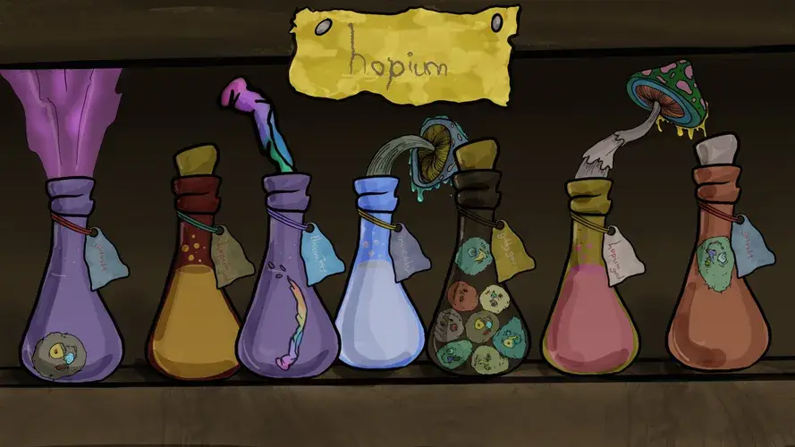

# Hopium.WTF

AAAAAUUUUGGGHHHHH Gobbs hobos ELF goblinnnS BURGURS 讲了 deM BURGurs 和战斗 KNEED hopiumm HOPIUM。 Elixir gud 4 BAttLe N BURGURs n degen buggz。 MHMmM taaaastey taistey 美味。 傻瓜我很聪明。 霍普姆古德。 文我们来了，隐藏GOB我把他们的头。 crustypoo yummmz n hopium take ovur BLOKCHIN。 hopiums.wtf 用于更多。 CC0 - 不保留版权。

什么是Hopium.WTF？
Hopium.WTF是一个NFT（不可替代令牌）集合。存储在区块链上的数字艺术品的集合。
▶ 有多少Hopium.WTF代币存在？
总共有4，444个Hopium.WTF NFT.目前有2，735个所有者在他们的钱包中至少有一个Hopium.WTF NTF。
▶ 最昂贵的Hopium.WTF销售是什么？
最昂贵的Hopium.WTF NFT售出的是Hopium #1467。它在2022-06-08（3个月前）以$ 90.5的价格出售。
▶ 最近售出了多少个Hopium.WTF？
在过去的30天内，有426个Hopium.WTF NFT售出。
▶ Hopium.WTF的费用是多少？
在过去的30天里，最便宜的Hopium.WTF NFT销售额低于6美元，最高销售额超过18美元。Hopium.WTF NFT的中位数价格是过去30天的12美元。
▶ 什么是流行的Hopium.WTF替代品？
许多拥有Hopium.WTF NFT的用户也拥有Final Dungeon，Digistacks，BlueChipsNFT Official和Nothing has Begin。

