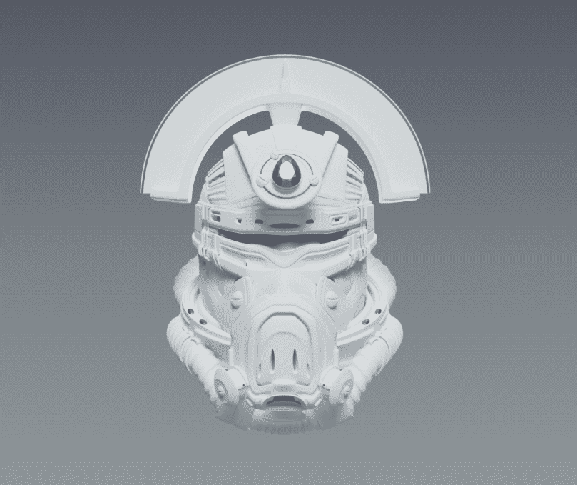

# Hor1zon Troopers

Hor1zon 项目是由 6,999 名士兵组成的集合，这些士兵在元宇宙中锻造并生活在以太坊区块链上。每个 NFT 都具有使其独一无二的特定属性和变量。持有一名士兵可以让所有者获得仅限会员的福利以及 Hor1zon Project 宇宙中的独家实体和虚拟商品。

Hor1zon 团队正在花时间仔细设计构建整个系列所需的每个 3D 元素。使用生成脚本，所有变量将随机组合以产生 6,999 名具有不同稀有属性的独特士兵。铸币阶段将在我们的以太坊区块链网站上提供，并带有 Metamask 集成

