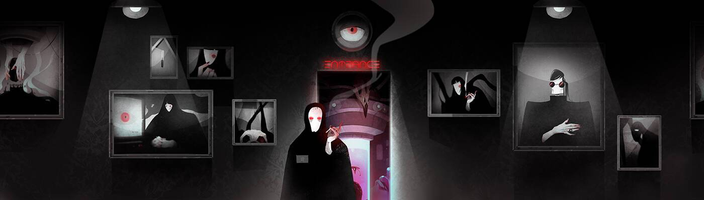

# An Appealing Collection of Horrific Things

一个被遗忘的梦想的空间，在焦虑的心灵深处。

一个吸引人的可怕事物集合NFT - 常见问题（FAQ）
▶ 什么是吸引人的可怕事物集合？
一个吸引人的可怕事物的集合是一个NFT（不可替代的令牌）集合。存储在区块链上的数字艺术品的集合。
▶ 有多少个吸引人的可怕事物集合令牌存在？
总共有40个“可怕的事物NFT的吸引人的集合”，目前有20个所有者在他们的钱包中至少有一个“可怕的事物的吸引人的集合NTF”。
▶ 最近卖了多少个吸引人的恐怖物品集？
在过去的30天内，有0个吸引人的可怕事物NFT集合售出。
▶ 什么是流行的“可怕的事物的吸引人的集合”替代品？
许多拥有A Appealing Collection of Horrific Things NFT的用户也拥有3NTITY-8PIRIT Mint Pass，Crypto Geishas，derschutze NFTees和Curious Cabins。

