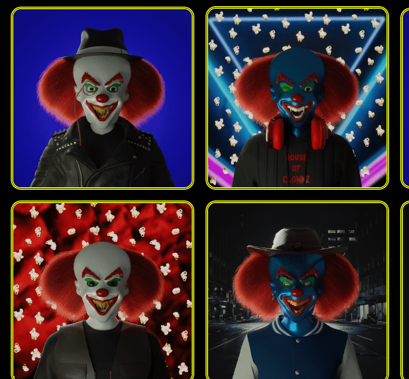

# House of Clownz

The House of Clownz NFT 是在以太坊区块链上发布的 10,000 个独特的 Clownz 的集合。每个属性在小丑的故事中都有独特的作用。持有小丑 NFT 可让您进入小丑镇的主要景点。

小丑镇是一个社区驱动的虚拟世界，它永远在成长。目前，小丑小镇由“大帐篷”、“鬼屋”、“三环”音乐节区组成。整个世界都具有动态音频，允许空间音频以及增强用户音乐和表演体验的控件。

House of Clownz NFT 在过去 7 天内售出 1573 次。House of Clownz 的总销售额为 7.92 万美元。House of Clownz NFT 的平均价格为 5 美元。House of Clownz 拥有 1,592 名所有者，总共拥有 9,922 个代币。

