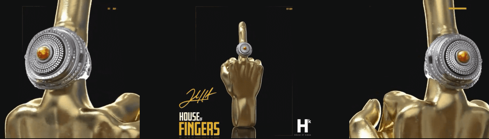

# House of Fingers

House of Fingers 是第一个可供 FuckCashGrabs 持有者使用的可申领 NFT。 FuckCashGrabs 是 Josh Hart 与 Tally Labs 合作针对 NFT 领域名人抢钱的表演性声明。 FCG 最初是免费铸造的，通过可索赔、仅限会员的体验、合作伙伴关系等为持有者增加价值。 House of Fingers 是与该领域最有才华的 NFT 工作室之一的 House of Kibaa 合作创建的。 这是给每个有手指头的人戴上戒指，并找到我们内心的冠军。

手指之家NFT - 常见问题（FAQ）
▶ 什么是手指之家？
手指之家是NFT（不可替代令牌）集合。存储在区块链上的数字艺术品的集合。
▶ 有多少个手指屋令牌存在？
总共有3，083个House of Fingers NFT.目前有1，252个所有者在他们的钱包中至少有一个House of Fingers NTF。
▶ 最近卖了多少个手指屋？
在过去的30天内售出了0个House of Fingers NFT。

