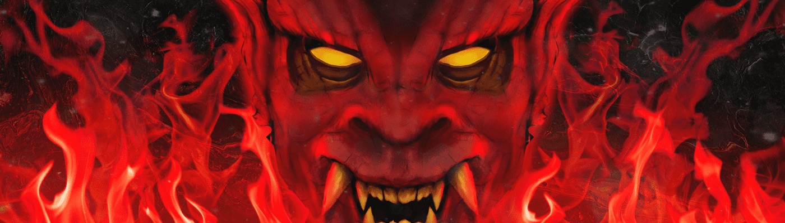

# House of Satan Masks

撒旦面具之家，撒旦之家的第二个系列。 设计为完美邪恶的 PFP。

撒旦之家面具NFT - 常见问题（FAQ）
▶ 什么是撒旦之家面具？
撒旦面具之家是NFT（不可替代令牌）的集合。存储在区块链上的数字艺术品的集合。
▶ 有多少个撒旦之家面具令牌存在？
总共有5，270个撒旦之家面具NFT.目前有399个所有者在他们的钱包中至少有一个撒旦面具之家NTF。
▶ 最近卖了多少个撒旦之家面具？
在过去的30天内售出了0个撒旦之家面具NFT。

