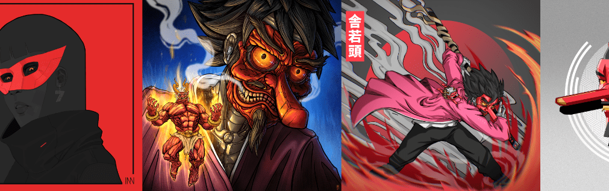

# The House of Tengu - An 0N1 Story

天狗之家系列讲述了一群来自通风口的无所畏惧的格格不入的人的故事，他们将不惜一切代价颠覆系统。 通过 0N1 社区中 7 位顶级艺术家的独特诠释，所有角色都栩栩如生。

天狗之家 - 0N1 故事 NFT - 常见问题（FAQ）
▶ 什么是天狗之家 - 0N1 的故事？
The House of Tengu - An 0N1 Story 是一个 NFT（非同质代币）集合。 存储在区块链上的数字艺术品集合。
▶ The House of Tengu - An 0N1 Story 代币有多少？
总共有 56 个 The House of Tengu - An 0N1 Story NFT。 目前，136 位业主的钱包中至少有一部 The House of Tengu - An 0N1 Story NTF。
▶ 《天狗之家 0N1 故事》最近卖出了多少？
过去 30 天内共售出 0 个 The House of Tengu - An 0N1 Story NFT。

