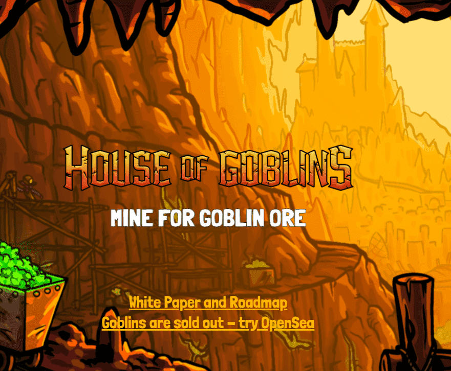

# House of Goblins

地精派系将在战场上形成并聚集在一起，为他们在矿山中开采更多地精矿石的权利而战。这就是您选择武器和分配这些武器的关键所在。赢家将从战争中获得回报，并看到采矿效率的提高，输家将看到下降。

▶ 什么是不再有效？

NFT（不可替代令牌）集合不再有效。存储在区块链上的数字艺术品集合。

▶ 有多少不再有效的代币存在？

总共有 7,171 个不再有效的 NFT。目前，1,178 位所有者的钱包中至少有一个不再有效的 NTF。

▶ 最近售出了多少不再有效？

过去 30 天内售出 0 个不再有效的 NFT。

