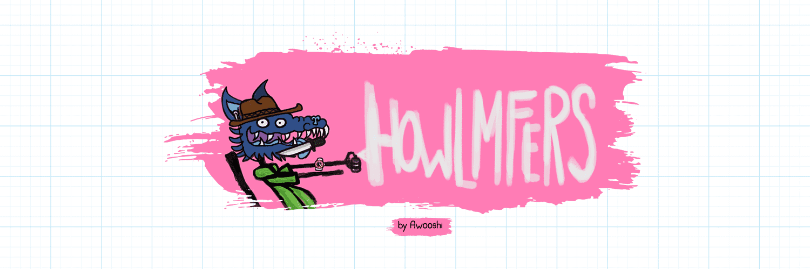

# howlmfers

6969 howlers x mfers by Awooshi     让爱不是战争

Howlmfers NFT - 常见问题（FAQ）
▶ 什么是咆哮者？
howlmfers是一个NFT（不可替代令牌）集合。存储在区块链上的数字艺术品的集合。
▶ 有多少个叫声令牌存在？
总共有6，969个howlmfers NFT.目前有736个所有者在他们的钱包中至少有一个howlmfers NTF。
▶ 什么是最昂贵的豪尔姆弗斯销售？
NFT出售的最昂贵的howlmfers是Howlmfers #5779。它在2022-06-21（2个月前）以1.1美元的价格出售。
▶ 最近卖了多少个吼叫声？
在过去的30天内，有7个咆哮的NFT售出。

