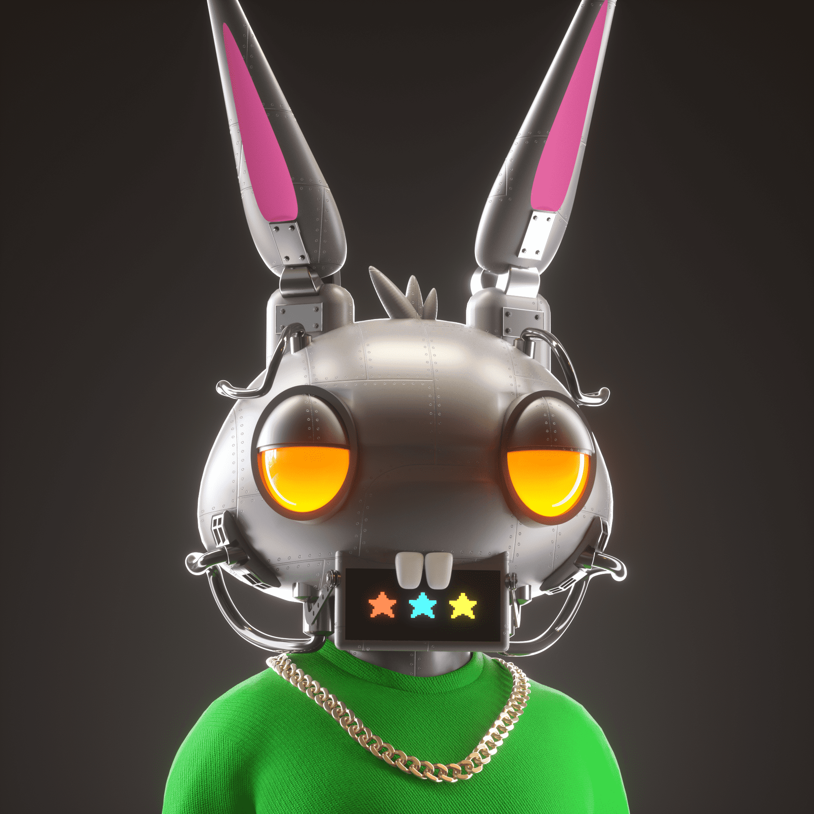

# HPPRS Collection

HPPRS 是 @shakkablood 的 8000 件生成集合。 HPPRS 是一群臭名昭著的兔子，他们参与恶作剧和令人发指的活动。 每个 HPPR 都是完全独特的，以各种形式/组合掩盖其身份。

HPPRS Collection NFT - 常见问题解答（FAQ）
▶ 什么是 HPPRS 软件集？
HPPRS 集合是 NFT（不可替代令牌）集合。存储在区块链上的数字艺术品的集合。
▶ 存在多少个 HPPRS 集合令牌？
总共有7，495个HPPRS集合NFT.目前有2，876个所有者在他们的钱包中至少有一个HPPRS集合NTF。
▶ HPPRS系列销售中最昂贵的是什么？
最昂贵的HPPRS Collection NFT销售的是HPPR #2855。它在2022-06-21（2个月前）以$ 823.4的价格出售。
▶ 最近售出了多少个HPPRS系列？
在过去30天内售出了148个HPPRS集合NFT。
▶ HPPRS 收集的费用是多少？
在过去的30天里，最便宜的HPPRS Collection NFT销售额低于52美元，最高销售额超过205美元。HPPRS Collection NFT的中位数价格在过去30天内为84美元。
▶ 什么是流行的HPPRS收集替代方案？
许多拥有HPPRS Collection NFT的用户也拥有Pidgies：Spy Pidgies Yob Squab，HPPR Hall Pass，GEVOLs和Genesis Heartbreak Friends。

