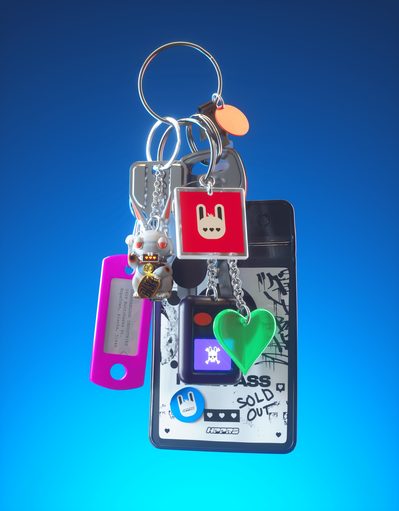

# HPPRS GIFT SHOP

您现在已经进入了HPPRS礼品店。商店里摆满了非凡的礼物和罕见的隐藏宝石。你们当中那些为HPPR而死的人，将获得光荣的财富。

HPPRS 礼品店 NFT - 常见问题解答（FAQ）
▶ 什么是HPPRS礼品店？
HPPRS GIFT SHOP是NFT（不可替代令牌）的集合。存储在区块链上的数字艺术品的集合。
▶ 有多少HPPRS礼品店代币存在？
目前，共有3个HPPRS礼品店NFT.目前有2，002名所有者的钱包中至少有一个HPPRS礼品店NTF。
▶ HPPRS礼品店销售中最昂贵的是什么？
NFT出售的最昂贵的HPPRS礼品店是加入或燃烧永恒。它在2022-06-25（2个月前）以$ 16.4的价格出售。
▶ 最近卖了多少家HPPRS礼品店？
在过去的30天内，有3个HPPRS礼品店NFT售出。
▶ 什么是流行的HPPRS礼品店替代品？
许多拥有HPPRS礼品店NFT的用户还拥有悟空天堂（多边形），不可替代的真菌空投，MoonMissers Official和Castle Kid's Eggdrop。

